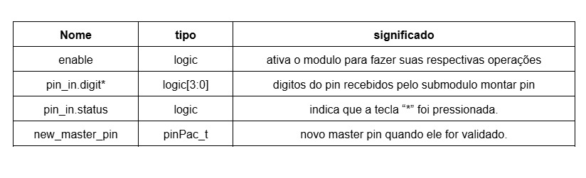

### Módulo: `update_master`

Este submódulo é responsável por atualizar a senha Master do sistema. Sua ativação ocorre em uma condição específica: após um reset do sistema, quando o usuário insere a senha Master padrão ("1234").

#### Interface do Módulo

```systemverilog
module update_master (
    input  logic       clk,
    input  logic       rst,
    input  logic       enable,
    input  pinPac_t    pin_in,
    output pinPac_t    new_master_pin
);
```


